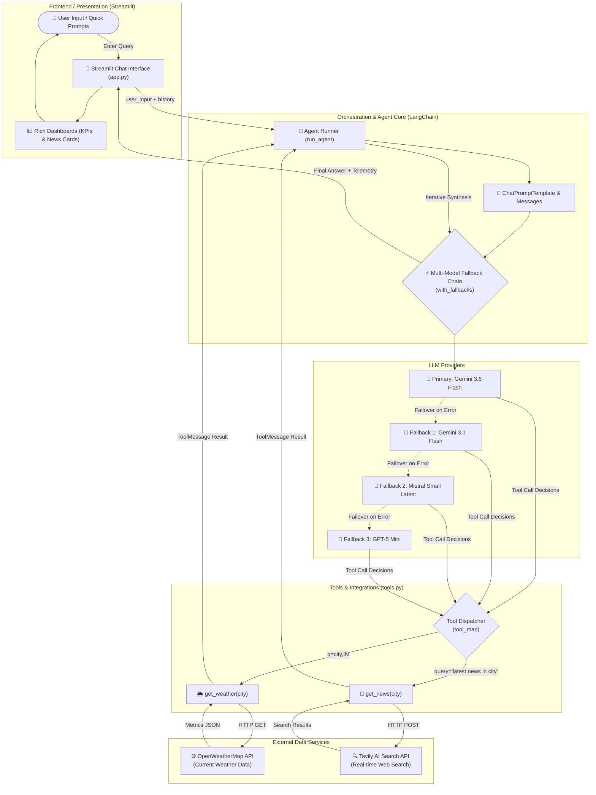
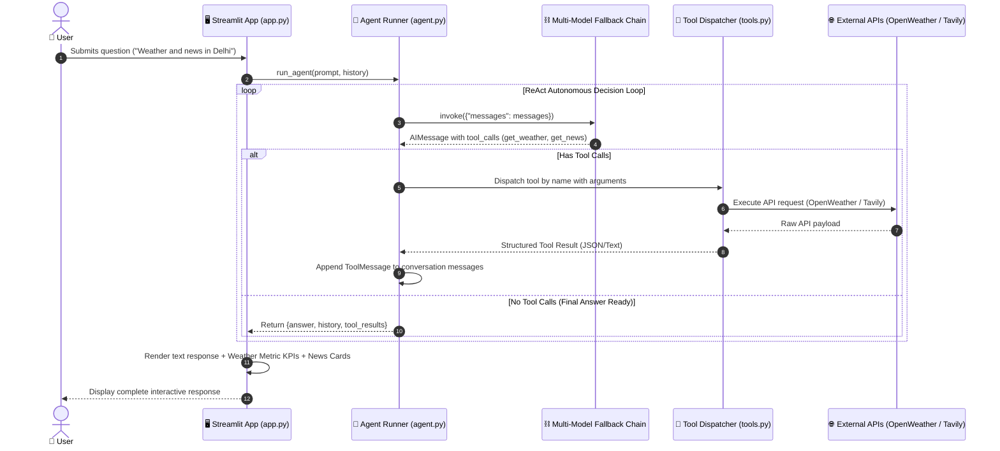
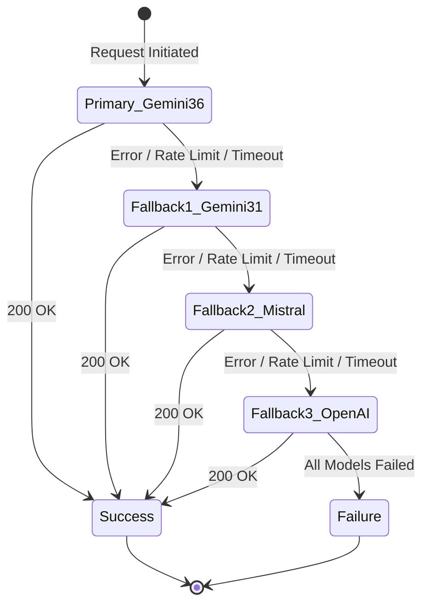

# 🏙️ City AI Agent

[](https://www.python.org/)
[](https://www.langchain.com/)
[](https://streamlit.io/)
[](https://aistudio.google.com/)
[](https://tavily.com/)
[](https://openweathermap.org/)
[](LICENSE)

An intelligent, multi-model conversational AI agent designed to provide real-time weather analytics and latest breaking news for cities across India. Powered by **LangChain**, **Google Gemini**, **Tavily Search**, **OpenWeatherMap**, and an interactive **Streamlit** dashboard with high-resilience multi-LLM fallback architecture.

---

## 📌 Table of Contents

- [Overview](#-overview)
- [Key Features](#-key-features)
- [System Architecture](#-system-architecture)
  - [High-Level Architecture Diagram](#high-level-architecture-diagram)
  - [Agent Execution & Tool Calling Flow](#agent-execution--tool-calling-flow)
  - [Multi-Model Fallback Failover Hierarchy](#multi-model-fallback-failover-hierarchy)
- [Project Structure](#-project-structure)
- [Tech Stack](#-tech-stack)
- [Getting Started](#-getting-started)
  - [Prerequisites](#prerequisites)
  - [Installation](#installation)
  - [Environment Configuration](#environment-configuration)
  - [Running the Application](#running-the-application)
- [Environment Variables](#-environment-variables)
- [Usage & Sample Queries](#-usage--sample-queries)
- [Author & Acknowledgments](#-author--acknowledgments)

---

## 🌟 Overview

**City AI Agent** bridges real-world real-time data with autonomous LLM reasoning. Traditional LLMs suffer from knowledge cutoffs and hallucination risks when asked about current conditions. City AI Agent solves this using **LangChain tool binding** and autonomous execution:

1. **Weather Analysis**: Accurately fetches live meteorological data (temperature, atmospheric pressure, humidity, coordinates) for any city in India via OpenWeatherMap.
2. **News Retrieval**: Gathers fresh, verified news articles with headlines, summaries, and source URLs via Tavily Search.
3. **Resilient AI Pipeline**: Implements seamless fallbacks across Google Gemini, Mistral AI, and OpenAI to prevent downtime caused by rate limits or outages.
4. **Rich Visual UI**: Renders answers alongside live execution badges, KPI metric scorecards, and clickable news cards.

---

## ✨ Key Features

- **Autonomous Tool Execution**: The agent automatically determines which tools to call (`get_weather`, `get_news`, or both) based on natural language intent.
- **Zero-Hallucination Policy**: Grounded explicitly in API responses. The agent is strictly instructed never to fabricate real-time data.
- **Enterprise Multi-LLM Fallbacks**:
  - Primary: `gemini-3.6-flash`
  - Fallback 1: `gemini-3.1-flash`
  - Fallback 2: `mistral-small-latest`
  - Fallback 3: `gpt-5-mini`
- **Dynamic Weather Dashboard**: Automatically parses JSON responses into interactive Streamlit metric widgets showing temperature (°C), atmospheric pressure (hPa), humidity (%), and precise latitude/longitude coordinates.
- **Curated News Feed**: Parses search results into responsive article cards with direct links to full news stories.
- **Full Conversational Memory**: Multi-turn conversation state retained within Streamlit session state for continuous contextual dialogue.
- **One-Click Quick Actions**: Pre-built starter prompts and instant chat reset capabilities.

---

## 🏗️ System Architecture

### High-Level Architecture Diagram



---

### Agent Execution & Tool Calling Flow



---

### Multi-Model Fallback Failover Hierarchy

LangChain's `with_fallbacks()` ensures that transient outages, rate limits (HTTP 429), quota exhaustion, or service degradation are handled gracefully without manual retry loops:



---

## 📂 Project Structure

```text
City_AI_Agent/
├── .env.example          # Environment variable template
├── .gitignore            # Git ignore file (excludes .env, venv, pycache)
├── agent.py              # LangChain agent core: multi-model chain & execution loop
├── app.py                # Streamlit web application: UI, dashboard & state management
├── requirements.txt      # Project Python dependencies
├── tools.py              # Custom LangChain tools for OpenWeather and Tavily
└── README.md             # Project documentation & architecture
```

### Module Responsibilities

| File | Primary Responsibility |
| :--- | :--- |
| **`agent.py`** | Initializes LLMs, configures tool binding, sets up multi-model fallback chain (`with_fallbacks`), defines prompt instructions, and manages the iterative tool execution loop. |
| **`app.py`** | Streamlit web frontend. Houses custom CSS styles, sidebar navigation, conversation state, message rendering, weather KPI dashboard widgets, and news link cards. |
| **`tools.py`** | Houses `@tool` decorated functions: `get_weather` (OpenWeatherMap) and `get_news` (Tavily AI Search) with structured response parsing and error handling. |
| **`.env.example`** | Documents all necessary API keys required to run the primary and fallback LLMs, weather, and news tools. |

---

## 💻 Tech Stack

- **Framework**: [LangChain](https://www.langchain.com/) (`langchain-core`, `langchain-google-genai`, `langchain-mistralai`, `langchain-openai`)
- **LLM Providers**:
  - Google AI Studio (`gemini-3.6-flash`, `gemini-3.1-flash`)
  - Mistral AI (`mistral-small-latest`)
  - OpenAI (`gpt-5-mini`)
- **Frontend / UI**: [Streamlit](https://streamlit.io/) with responsive custom HTML/CSS styling
- **Search & News API**: [Tavily Search API](https://tavily.com/)
- **Weather API**: [OpenWeatherMap REST API](https://openweathermap.org/)
- **Runtime Environment**: Python 3.10+

---

## 🚀 Getting Started

### Prerequisites

- Python 3.10 or higher installed on your machine.
- Valid API keys for:
  - **Google AI Studio** (required for primary LLM)
  - **OpenWeatherMap** (required for weather lookup)
  - **Tavily Search** (required for news search)
  - *Optional but recommended for fallback*: Mistral AI & OpenAI

### Installation

1. **Clone the repository**:
   ```bash
   git clone https://github.com/thecoder-prog/City_AI_Agent.git
   cd City_AI_Agent
   ```

2. **Create and activate a virtual environment**:
   - **Windows**:
     ```powershell
     python -m venv .venv
     .venv\Scripts\activate
     ```
   - **macOS / Linux**:
     ```bash
     python3 -m venv .venv
     source .venv/bin/activate
     ```

3. **Install dependencies**:
   ```bash
   pip install -r requirements.txt
   ```

### Environment Configuration

1. Copy `.env.example` to create your `.env` file:
   - **Windows**:
     ```powershell
     Copy-Item .env.example .env
     ```
   - **macOS / Linux**:
     ```bash
     cp .env.example .env
     ```

2. Open `.env` in your text editor and add your API keys:
   ```env
   GOOGLE_API_KEY=AIzaSy...
   MISTRAL_API_KEY=...
   OPENAI_API_KEY=sk-...
   OPENWEATHER_API_KEY=...
   TAVILY_API_KEY=tvly-...
   ```

### Running the Application

Launch the Streamlit web application:

```bash
streamlit run app.py
```

Once launched, open your browser to the local URL (typically `http://localhost:8501`).

---

## 🔑 Environment Variables

| Variable | Provider | Purpose | Required? |
| :--- | :--- | :--- | :--- |
| `GOOGLE_API_KEY` | Google AI Studio | Powers primary `gemini-3.6-flash` and secondary fallback `gemini-3.1-flash`. | **Yes** |
| `OPENWEATHER_API_KEY` | OpenWeatherMap | Fetches current weather, temperature, humidity, pressure, and coordinates. | **Yes** |
| `TAVILY_API_KEY` | Tavily AI | Fetches up-to-the-minute local news headlines and URLs. | **Yes** |
| `MISTRAL_API_KEY` | Mistral AI | Powers fallback model (`mistral-small-latest`) if Gemini is rate limited. | *Recommended* |
| `OPENAI_API_KEY` | OpenAI | Powers fallback model (`gpt-5-mini`) as final failover layer. | *Recommended* |

---

## 💡 Usage & Sample Queries

Try asking the agent any of the following queries:

- **Weather Queries**:
  - *"What is the current weather in Mumbai?"*
  - *"How is the temperature in Bengaluru today?"*
- **News Queries**:
  - *"What is the latest news in Pune?"*
  - *"Any updates on traffic and events in Hyderabad?"*
- **Combined Queries**:
  - *"Give me the current weather and latest news in Delhi."*
  - *"What is happening in Kolkata right now and is it raining?"*

---

## 👨‍💻 Author & Acknowledgments

- **Designed & Developed by**: **Yogesh Bhore** ([@thecoder-prog](https://github.com/thecoder-prog))
- **Core Technologies**: LangChain, Google DeepMind, Streamlit, Tavily AI, OpenWeatherMap.

---

## 📄 License

This project is licensed under the [MIT License](LICENSE) — feel free to use and adapt it for your projects!
